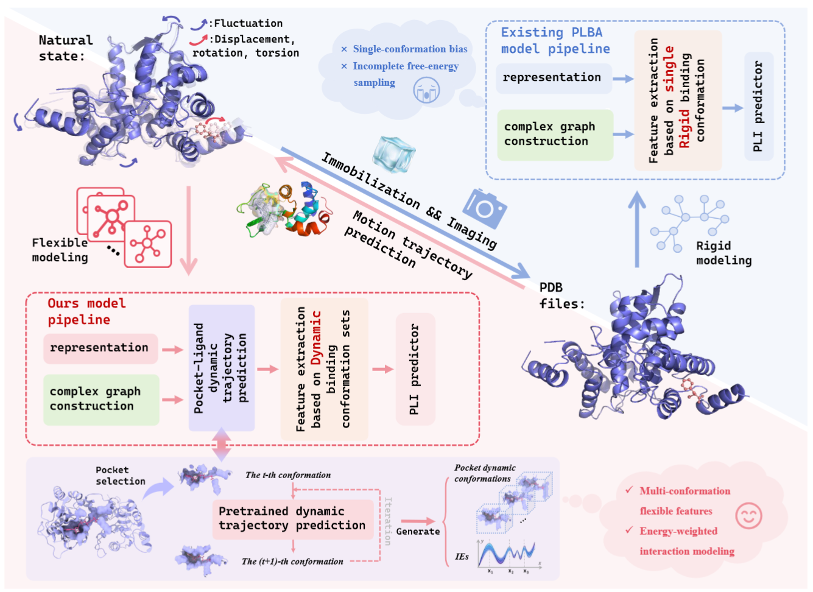
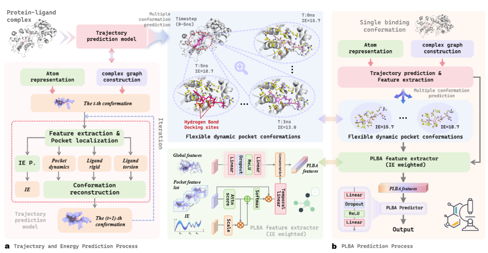
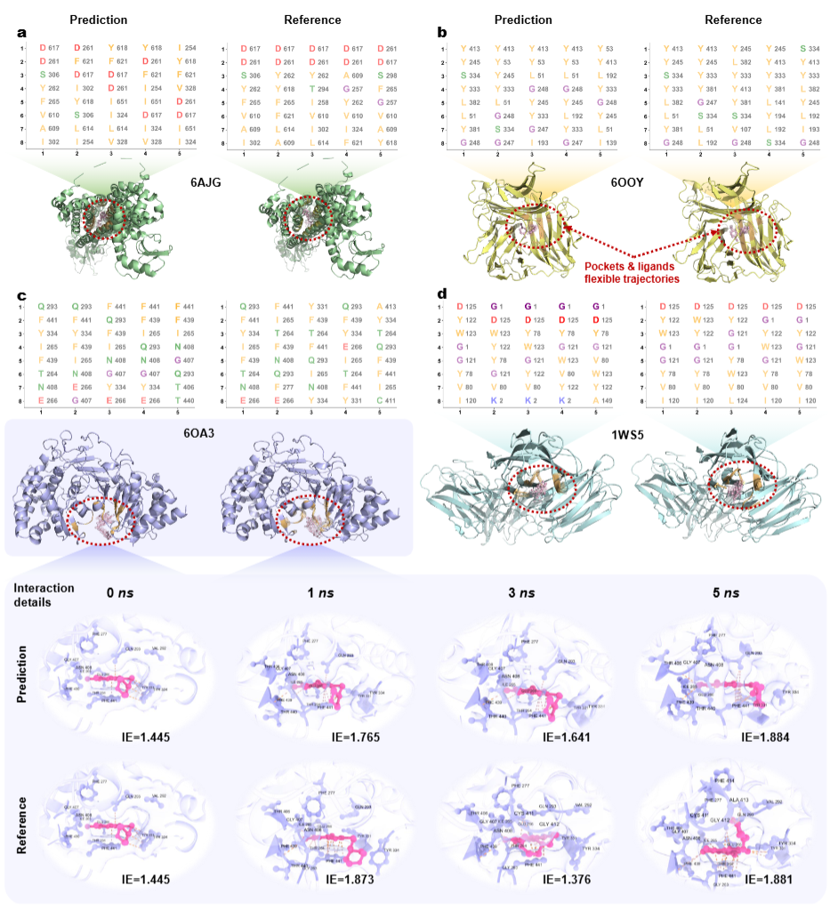

# D-PLBA

<div align="center">

### Dynamic Pocket–Ligand Binding Affinity Prediction

**D-PLBA** is a dynamics-driven framework for **protein–ligand binding affinity (PLBA) prediction** that explicitly models the conformational evolution of pocket–ligand complexes together with the corresponding changes in interaction energies.


</div>

---

## Overview

Most existing PLBA prediction methods characterize protein–ligand interactions using a **single static complex**, which provides only a limited description of the inherently dynamic binding process.

D-PLBA addresses this limitation by explicitly incorporating the **dynamic evolution of pocket–ligand binding states** into affinity prediction. Starting from an initial protein–ligand complex, D-PLBA predicts a sequence of dynamically evolving pocket–ligand conformations together with their corresponding interaction energies. These structural and energetic states are subsequently exploited to obtain a more comprehensive characterization of the binding process for affinity prediction.

<p align="center">
  
</p>

---

## Key Features

- **Dynamics-aware PLBA prediction**  
  Moves beyond conventional single-structure modeling by explicitly incorporating multiple dynamically evolving pocket–ligand binding states.

- **Pocket–ligand trajectory prediction**  
  Predicts the conformational evolution of the binding pocket and ligand directly from an initial protein–ligand complex.

- **Dynamic interaction-energy modeling**  
  Simultaneously estimates the evolution of pocket–ligand interaction energies across predicted binding states.

- **Joint structural and energetic representation**  
  Integrates complementary conformational and energetic information to provide a more comprehensive representation of protein–ligand binding.

---

## Framework

D-PLBA consists of two major stages:

1. **Dynamic pocket–ligand state prediction**  
   Given an initial protein–ligand complex, D-PLBA iteratively predicts the conformational evolution of the binding pocket and ligand, together with the corresponding interaction energy at each frame.

2. **Dynamic PLBA prediction**  
   The resulting multi-frame binding conformations and interaction energies are incorporated into affinity prediction, allowing D-PLBA to account for both structural flexibility and energetic variation during the binding process.

<p align="center">
  
</p>

<p align="center">
  <b>Overview of the D-PLBA framework.</b><br>
  (a) Prediction of pocket–ligand motion trajectories and interaction energies.<br>
  (b) Dynamic protein–ligand binding affinity prediction.
</p>

---

## Installation

### Requirements

The current implementation has been tested in the following environment:

| Package | Version |
| --- | --- |
| Python | 3.8.0 |
| PyTorch | 1.8.0 |
| CUDA | 11.7 |
| PyTorch Geometric | **2.3.1** |
| RDKit | 2022.09.5 |
| Biopython | 1.79 |

> **Note:** The current codebase is compatible with **PyTorch Geometric (PyG) >= 2.0**.

---

## Dataset

The PLBA dataset used in this project is available through **Zenodo**.

### PLBA Dataset

[](https://zenodo.org/records/22069317)

**Download:**  
https://zenodo.org/records/22069317

The dataset contains the protein–ligand complexes and associated data used for training and evaluating D-PLBA.

---

## Pretrained Model

The trained D-PLBA model is available through Google Drive.

### Model Checkpoint

[](https://drive.google.com/file/d/1K18LaKkUnKy6Mdhcg7E0xTgVa7sHf2Rm/view?usp=drive_link)

**Download:**  
https://drive.google.com/file/d/1K18LaKkUnKy6Mdhcg7E0xTgVa7sHf2Rm/view?usp=drive_link

The pretrained checkpoint can be used for model evaluation and downstream PLBA prediction.

---

## Dynamic Trajectory Visualization

The following examples compare the **predicted pocket–ligand dynamic trajectories** with their corresponding reference trajectories.

Four randomly selected complexes are shown. The enlarged visualization of **6OA3** further highlights the binding-pocket region and illustrates the evolution of pocket–ligand conformations together with the corresponding interaction energies.

<p align="center">
  
</p>

<p align="center">
  <b>Examples of predicted and reference pocket–ligand dynamic trajectories.</b><br>
  The enlarged view of 6OA3 highlights the binding-pocket region and its dynamic evolution together with the corresponding interaction energies.
</p>

---

## Citation

If you find **D-PLBA** useful in your research, please consider citing our work.

```bibtex
@unpublished{DPLBA,
  title  = {D-PLBA},
  author = {},
  note   = {Manuscript under review},
  year   = {2026}
}
```

The complete citation information will be updated upon publication.

---

## Resources

| Resource | Link |
| --- | --- |
| PLBA Dataset | [Zenodo](https://zenodo.org/records/22069317) |
| Trained Model | [Google Drive](https://drive.google.com/file/d/1K18LaKkUnKy6Mdhcg7E0xTgVa7sHf2Rm/view?usp=drive_link) |

---

<div align="center">

### D-PLBA

**Dynamic modeling of pocket–ligand binding states for protein–ligand binding affinity prediction**

</div>
